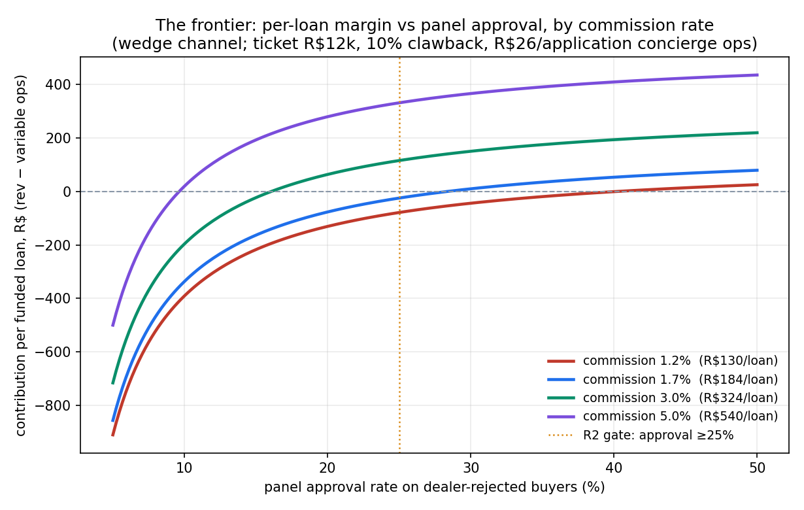
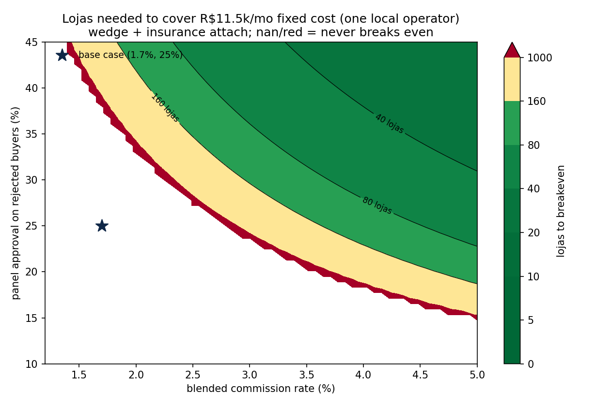

# Aggregator P&L — the one-day model (2026-06-10)

The 2026-06-10 review's #1 finding: every prior model priced the abandoned lead-gen version; the live thesis (earn the origination) had no P&L. This is that P&L. **Headline: at corpus-typical commission (1.7%), the rejected-buyer wedge — the thesis's flagship pitch — is *negative per loja* even before fixed costs. The business only clears via (a) commission ≥~2.5–3% and/or (b) converting lojas to whole-flow F&I.** The venture-defining variable is no longer just CAC — it's the **commission rate**, which is a *Phase-0 contract read, not a field test*.

## The arithmetic

**Revenue per funded loan** = ticket × commission × (1 − clawback) = R$12,000 × 1.7% × 0.9 = **R$184 (~$34)**.

Per weak loja (~30 motos/mo → ~15 finance applicants → ~6 dealer-bank rejects), at the R2 gate thresholds (panel approval 25%, approved→funded 50%):

| Scenario | Funded /loja/mo | Contribution R$/loja/mo | Lojas to cover 1 operator (R$11.5k/mo) | Lojas for ~$500k/yr gross |
|---|---:|---:|---:|---:|
| **S1 wedge-only** (uncontested commission) | 0.75 | **−118** | **never** | 1,634 |
| **S2 wedge + insurance attach** (30% × R$150) | 0.75 | **−85** | **never** | 1,312 |
| **S3 whole-flow F&I takeover** (all applicants, 50/50 commission split w/ dealer) | 6.30 | **+372** | **31** | **261** |

Variable ops alone (concierge re-keying ~R$26/application across all 6 rejects + R$100/mo loja BD) exceed wedge revenue (0.75 × R$184 ≈ R$138). The wedge is structurally thin: you pay processing on every reject but collect on ~1 in 8.

## The frontier — what parameters rescue it

Per-loan margin vs panel approval, by commission: at **1.2%** commission the wedge needs >40% panel approval just to break even per-loan; at **1.7%**, ~28%; at **3%**, ~16%; at **5%**, ~10%. The R2 gate (25%) only clears with commission ≳2.5%.

Lojas needed to cover one local operator (wedge + insurance attach): the **base case (1.7%, 25%) sits in the never-breaks-even region**. The viable (green) region wants commission ≥3% *and* approval ≥25%, where 20–60 lojas cover the fixed base.

## What this changes

1. **The wedge is the entry pitch, not the business.** "Win on the buyers your bank rejects" gets the QR into the loja at zero conflict — but the P&L only works if lojas convert to **whole-flow F&I** (you run all applications, sharing commission 50/50: +R$372/loja/mo, 31 lojas to one operator, ~261 to $500k/yr gross). That conversion motion is the actual product.
2. **Commission rate is the venture-defining variable** — and it's readable from correspondente contract tables in Phase-0 for ~$0. Corpus sources disagree (lane report 1.2–1.8% vs dealer-CAC report 2–5%, CMN cap 6%; used/subprime typically pays more). If real-world blended commission is ~3%+ (plausible for used/subprime via Omni), the picture improves materially; if ~1.5%, wedge-only is dead on arrival.
3. **Insurance attach is a rounding error at wedge volume** (+R$34/loja/mo) but meaningful at whole-flow volume (~R$284/loja/mo of S3's contribution).
4. **The R2 kill-gate gains a number:** cost per funded loan must come in under R$184 at 1.7% — i.e., panel approval × funded-rate must beat ops ÷ R$184 ≈ 14% joint conversion on processed rejects.

## Honest caveats

Reject volume (6/loja/mo) and ops cost (R$26/app) are estimates — bigger lojas or cheaper processing shift the frontier favorably; a softer entrada (funded <50%) shifts it against. Commission is THE uncertainty — both directions. The model excludes incorporation/cert one-offs and any paid CAC (paid traffic already ruled out; dealer-QR marginal CAC ≈ BD line). Code: `workbench/latam-2w-aggregator-pnl/model.py` (rerun with any parameter set).

## Bottom line

"Capital-light aggregator" survives only as **wedge-to-whole-flow**: enter on rejected buyers, convert the loja to full F&I within months, attach insurance at volume. Phase-0 now has a sharper job: **read the commission tables first** — a blended take ≥~2.5–3% is the existence condition for the whole venture.
